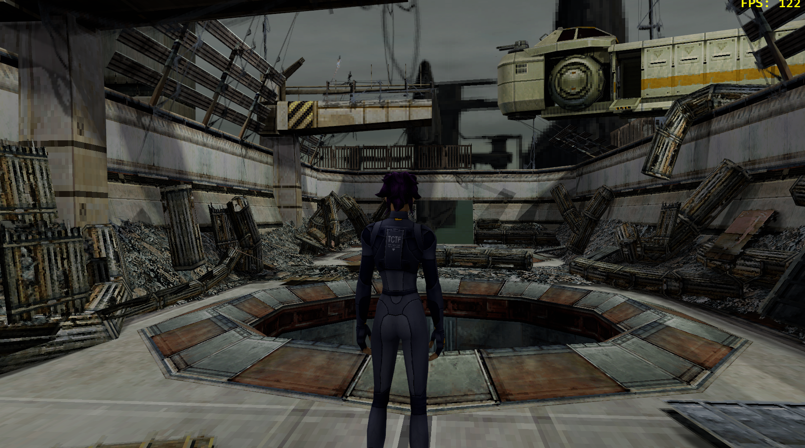
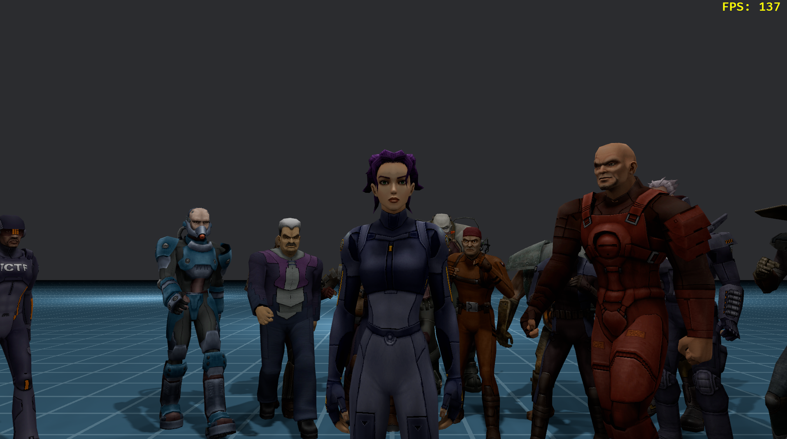
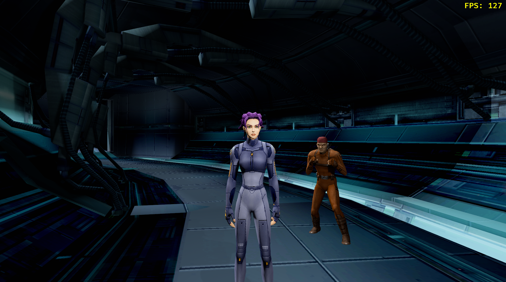
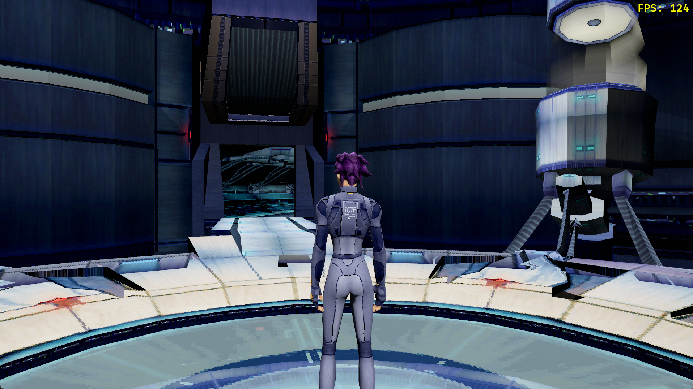
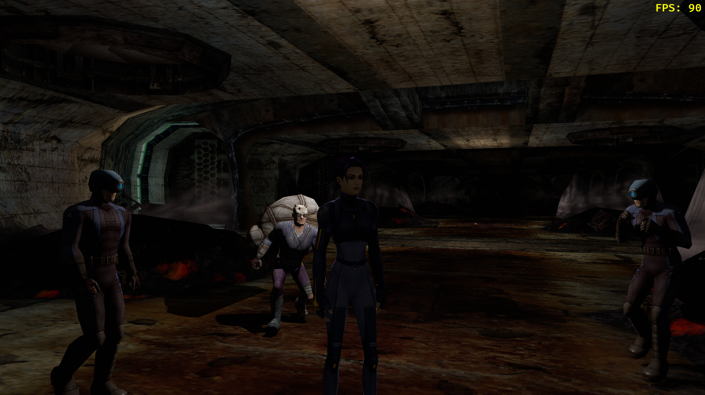

# Oni2Rebuilt

`Oni2Rebuilt` is a Rust workspace that gathers the three crates needed to work on
this reverse engineered Oni 2 prototype:

- `game/` &mdash; the Bevy-based client that can load Oni 2 assets and test
  gameplay systems.
- `server/` &mdash; Axum + DataFusion backend services for ingesting telemetry
  and gameplay data.
- `shared/` &mdash; protobuf definitions plus the utilities that are shared by
  the game and the server.

## Getting Started

```
cargo build --workspace
```

The workspace uses Rust 1.78+ (edition 2024) and expects that you have the
Bevy/Linux dependencies installed locally.

## Visuals








## Running the game
1. Download the Oni 2 (Angel Studios) ISO from the [Oni 2 Archive](https://wiki.oni2.net/Oni_2_(Angel_Studios)).
2. Use 7zip to extract the contents of the ISO.
3. Locate the `RB.DAT` file within the extracted archive.
4. Pass the relative or absolute path of the directory containing `RB.DAT` to `rb-game` via the `--dat` flag.

```sh
cargo run --bin rb-game -- --dat path/to/extracted/iso/dir
```

Optionally, you can also inject custom raw files to override the `RB.DAT` archive using the `--path` flag:
```sh
cargo run --bin rb-game -- --dat path/to/extracted/iso/dir --path path/to/raw/assets/dir
```

## Command-line flags

By default the game boots into the dev test-layout picker — a list of every
layout folder on disk with descriptions from `Settings/rb.gamedata`. Esc from
a level returns there. The shipped `rbfrontend.ui` menu (Rockstar/Angel
intros → Oni2 logo → Main Menu → Choose Level) is being rebuilt and is
opt-in via `--ogmenu` until it's polished.

### Asset sources
- `--dat <path>` &mdash; mount a `RB.DAT` (or `STREAMS.DAT` / `BANKS.DAT`)
  archive. Pass the flag multiple times to mount more than one. Defaults to
  `RB.DAT`, `STREAMS.DAT`, `BANKS.DAT` in the working directory.
- `--path <dir>` &mdash; mount a loose-files directory as a higher-priority
  overlay on top of any `--dat` mounts. Pass multiple times to overlay more
  than one. Defaults to `oni2/zips/assets` and `oni2/zips/streams`.

### Startup mode (mutually exclusive)
- *(no flag)* &mdash; boot into the dev test-layout picker (formerly
  `--testlayout`). Esc from in-game returns here.
- `--ogmenu` &mdash; opt into the in-progress `rbfrontend.ui` menu graph.
  Esc from in-game returns to the menu instead of the picker.
- `--testlayout` &mdash; accepted as a no-op alias for the default; kept so
  existing run scripts keep working.
- `--layout <name>` &mdash; skip the menu and load the named layout directly,
  e.g. `--layout M03_A01_Blast_Chambers`.
- `--testanim <path>` / `--animtest <path>` &mdash; jump straight into the
  animation viewer. If `<path>` ends in `.anim` it boots in-game; otherwise it
  opens the anim picker pre-filtered to the entity name.
- `--testentity <name>` / `--entitytest <name>` &mdash; load a single entity
  for inspection. Omit `<name>` to open the entity picker.
- `--sandbox` &mdash; boot into the sandbox scene.
- `--formation` &mdash; boot into the formation/AI test scene with a free
  camera (`oni2_loader::free_camera_system`).

### Toggles
- `--fog` &mdash; enable layout fog (disabled by default).
- `--diagnostics` &mdash; install Bevy's `LogDiagnosticsPlugin` (frame-time
  / FPS log spam).

## Repo Layout

```
game/    # Bevy client + asset tooling
server/  # Axum/DataFusion server utilities
shared/  # Shared protobuf + data model crate
```

Each crate is a regular Cargo package inside the workspace, so `cargo test -p
rb-game` or `cargo run -p rb-server` work as expected. See `docs/` for deeper
notes on publishing or asset preparation if you are setting this up locally.

## Original Research
* The toughest part was the binary model format loader, how that maps to material groups and skin weights

## Thank you
* Huge shout out to the https://wiki.oni2.net/OBD:Oni2AS analysis that outlined most of the formats
* https://github.com/vgmstream/vgmstream/blob/master/doc/FORMATS.md for the nitty-gritty of decoding the sound files
